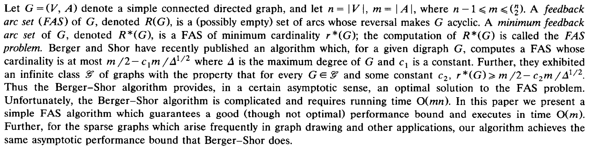
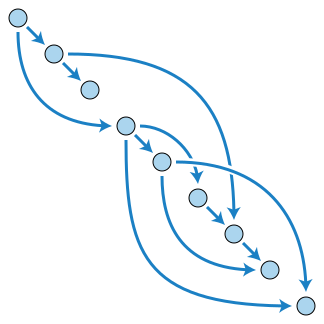

# A fast and effective heuristic for the feedback arc set problem




[Original paper](https://www.sciencedirect.com/science/article/pii/002001909390079O)



### Input format:

A set of edges in the format:

```
node⇥parent_node
```

one per line.

### Output format:

The set of edges that respect the topological ordering in the same format.